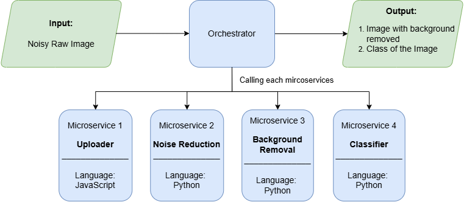

# Microservices Image Processing Pipeline — REST & gRPC

This repository contains a fully containerized **microservices-based image processing pipeline**, implemented for both **REST** and **gRPC**, across two deployment setups:

- `local/` → All microservices run on a **single machine**
- `multiple/` → Microservices run on **multiple machines (distributed)**

Each setup includes both REST and gRPC versions, organized as:

```bash
local/
   ├── rest_version/
   └── grpc_version/

multiple/
   ├── rest_version/
   └── grpc_version/
```

Before running anything, ensure you **cd into the specific directory** of the version you want to execute.

## Pipeline Overview
The system processes images through several independent microservices:
1. Uploader Service
2. Noise Reduction Service
3. Background Removal Service
4. Classifier Service  





Each service runs independently in a Docker container, allowing scalable deployment on **single-machine** or **multi-machine** (distributed) setups.


## Features

### **gRPC Version**

- Uses Protocol Buffers (binary)
- Faster, smaller payload
- Designed for distributed environments


### **REST Version**

- Uses HTTP APIs
- Easy to debug
- Readable JSON requests/responses
- Higher latency than gRPC

### **Modular Microservices**
Each microservice performs a specific task:
- **Uploader** — Receives images and forwards them.
- **Noise Reducer** — Removes noise from images.
- **Background Removal** — Extracts foreground via segmentation.
- **Classifier** — Predicts the class label.

### **Deployment Options**
- **Single Machine:** All services run locally.
- **Distributed Mode:** Each service runs on different machines.

# To Run the Code
## 1. LOCAL SETUP (Single Machine)

All services run on one machine, using `docker-compose`.

### Run REST (Local)
```bash
cd local/rest_version
docker compose up -d --build
```

### Run gRPC (Local)
```bash
cd local/grpc_version
docker compose up -d --build
```

### View logs
```bash
docker compose logs -f
```

## 2. MULTIPLE SETUP (Distributed — Multiple Machines)

In this setup:

- **Machine A (Orchestrator)** → Runs pipeline entry point + service connectors
- **Machine B, C, D, E...** → Each runs ONE microservice
- You must **manually run the Dockerfile** for each microservice on its machine

### 2.1 Running REST (Distributed)

#### Step 1: Run orchestrator (on main machine)
```bash
cd multiple/rest_version
docker compose up -d --build
```

#### Step 2: Run each microservice on its own machine

Example (Background Removal machine):
```bash
docker build -t rest-background-removal -f Dockerfile.background .
docker run -d -p 50062:50062 --name rest-background-removal rest-background-removal
```

Repeat for:
- Uploader
- Noise Reducer
- Background Removal
- Classifier

(Each service has its own Dockerfile in its folder.)

### 2.2 Running gRPC (Distributed)
#### Step 1: Run orchestrator (on main machine)
```bash
cd multiple/grpc_version
docker compose up -d --build
```

#### Step 2: Run each microservice manually on its own machine

Example (Classifier machine):
```bash
docker build -t grpc-classifier -f Dockerfile.classifier .
docker run -d -p 50064:50064 --name grpc-classifier grpc-classifier
```

Repeat for all microservices.

## 3. Running the Pipeline Client

Use `pipeline_client.py` to send an image through the pipeline.

### Install required Python libraries
pip install requests grpcio grpcio-tools opencv-python protobuf

### Run the client
```bash
python pipeline_client.py
```

Depending on the configuration, the client will contact the:
- Local REST services
- Local gRPC services
- Distributed REST services
- Distributed gRPC services

## Output & Results

Results are stored automatically for each setup:
```bash
local/rest_version/results/
local/grpc_version/results/

multiple/rest_version/results/
multiple/grpc_version/results/
```

You will find:
- Final processed images
- Pipeline Image
- Latency logs

(Intermediate outputs will be stored at each each version `pipeline_timeline` folder.)

## **📦 Technologies Used**

- Docker & Docker Compose
- Python (Flask / FastAPI for REST)
- gRPC & Protocol Buffers
- OpenCV / Image Processing Libraries
- Distributed System Techniques
- Logging & Benchmarking Tools
